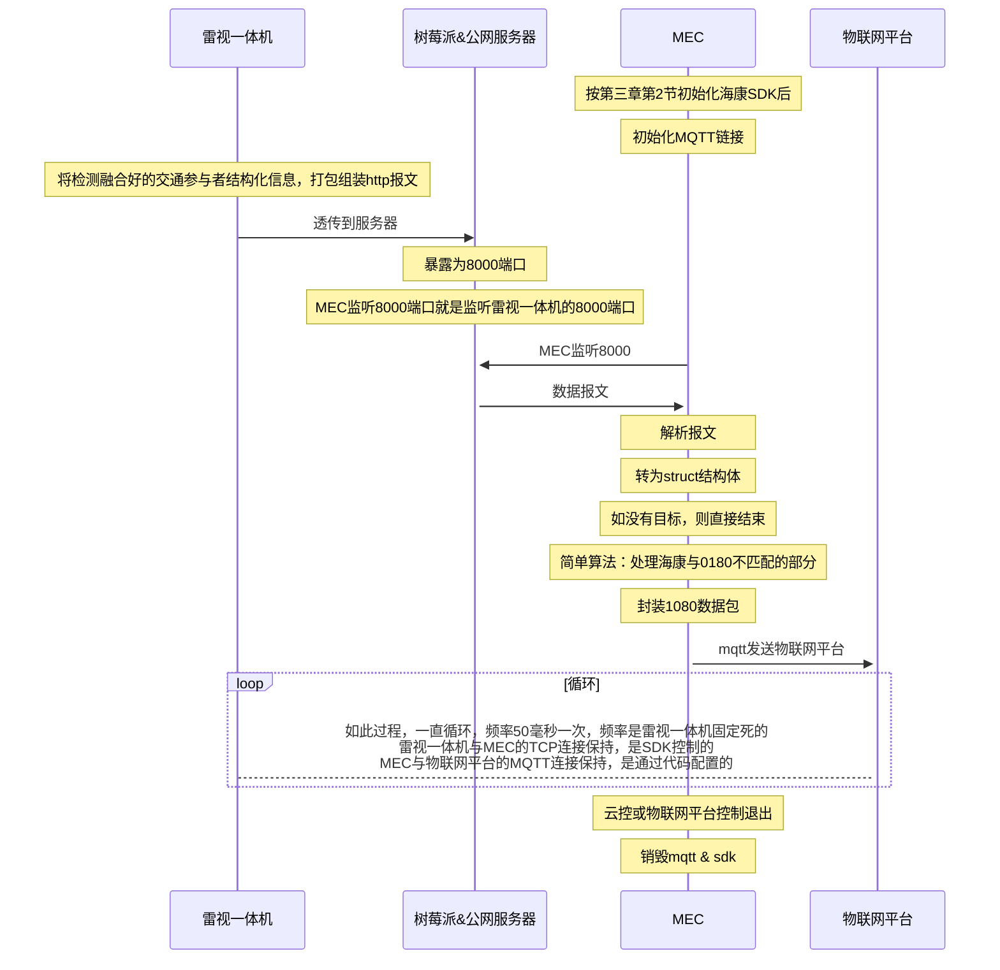
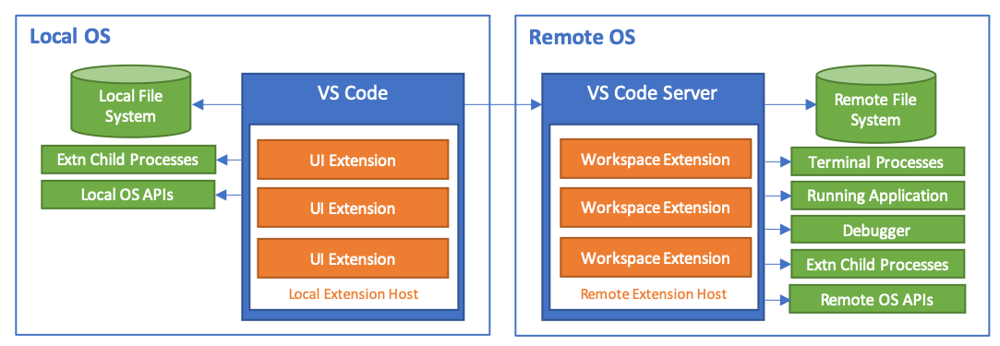
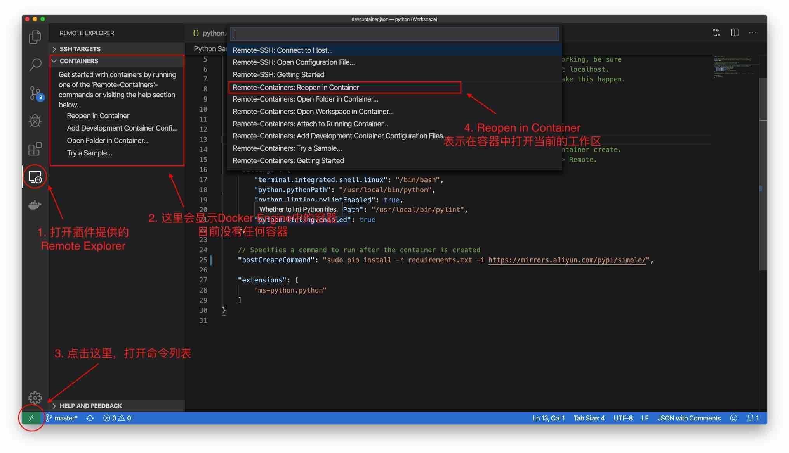
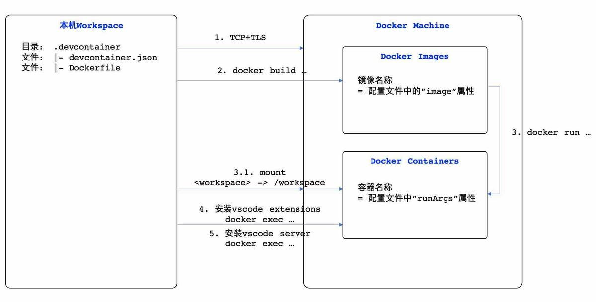
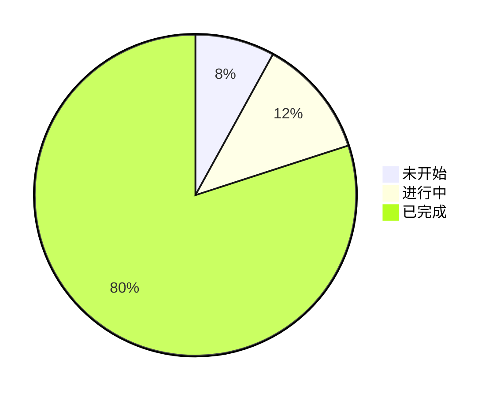
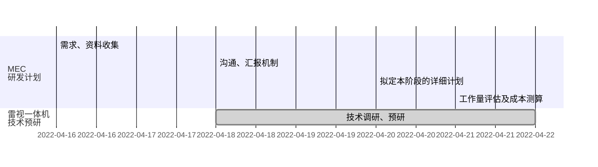
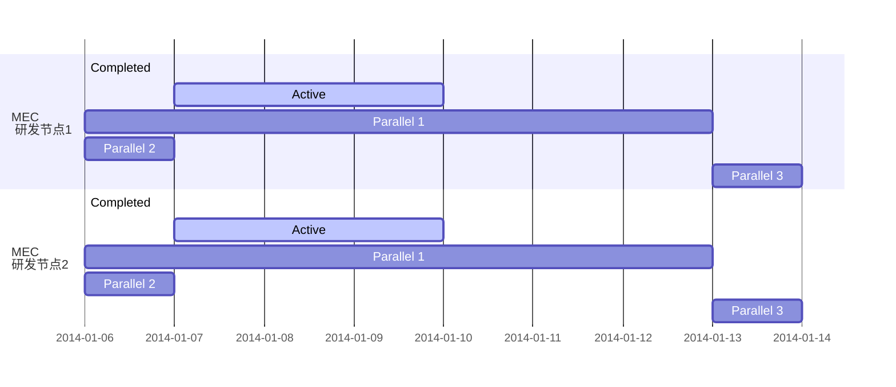
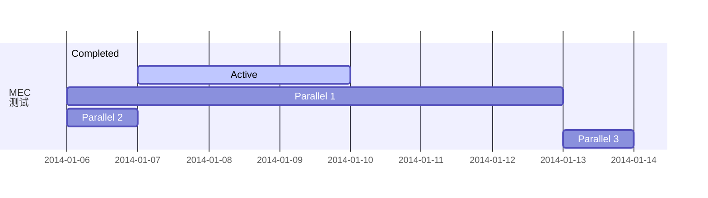

# 基于海康雷视一体机的MEC

[TOC]

<div style="page-break-after: always;"></div>

## 版本记录
|  版本号 | 更新内容 | 更新者  | 更新时间 | 
|---|---|---|---|
|  1.0.0 | 创建文档 | 尹彬  |  2022-5-25 11:50  |
|  1.0.1 | 增加：PDF版本、MD源码下载，修复“物联网平台”文字错误 | 尹彬  |  2022-5-25 15:10 |
|  1.0.2 | 增加：[nodered启动命令](#1-启动-nodered) | 尹彬  |  2022-5-25 18:14 |
|  1.0.3 | 增加：[容器化后，还有哪些工作要做](#4-容器化后还有哪些工作要做) | 尹彬  |  2022-5-27 10:20 |
|  1.0.4 | 增加：[vscode&docker快速了解](#5-vscode-的-dev-remote-container了解) | 尹彬  |  2022-5-27 10:35 |
|  1.0.5 | 增加：[mec硬件选型](#6-mec硬件选型) | 尹彬  |  2022-5-27 11:06 |
|  1.0.6 | 增加：[word版本下载链接](#文档下载) | 尹彬  |  2022-5-27 12:00 |

## 文档下载

- Word版在线预览：[基于海康雷视一体机的MEC设计.docx](http://doc.hiacent.info/mec1.0/基于海康雷视一体机的MEC设计.docx)
- PDF版在线预览：[基于海康雷视一体机的MEC设计.pdf](http://doc.hiacent.info/mec1.0/基于海康雷视一体机的MEC设计.pdf)
- MD源码下载：[基于海康雷视一体机的MEC设计.md](http://doc.hiacent.info/mec1.0/基于海康雷视一体机的MEC设计.md)
- 0180规范下载：[0180 pdf](./standard/T%E2%88%95ITS0180.1-2021%E8%BD%A6%E8%B7%AF%E5%8D%8F%E5%90%8C%E4%BF%A1%E6%81%AF%E4%BA%A4%E4%BA%92%E6%8A%80%E6%9C%AF%E8%A6%81%E6%B1%82%E7%AC%AC1%E9%83%A8%E5%88%86%EF%BC%9A%E8%B7%AF%E4%BE%A7%E8%AE%BE%E6%96%BD%E4%B8%8E%E4%BA%91%E6%8E%A7%E5%B9%B3%E5%8F%B0.pdf)
- 0180规范在线看：[0180 html](./standard/T%E2%88%95ITS0180.1-2021%E8%BD%A6%E8%B7%AF%E5%8D%8F%E5%90%8C%E4%BF%A1%E6%81%AF%E4%BA%A4%E4%BA%92%E6%8A%80%E6%9C%AF%E8%A6%81%E6%B1%82%E7%AC%AC1%E9%83%A8%E5%88%86%EF%BC%9A%E8%B7%AF%E4%BE%A7%E8%AE%BE%E6%96%BD%E4%B8%8E%E4%BA%91%E6%8E%A7%E5%B9%B3%E5%8F%B0.pdf.html)
- [T∕CSAE248-2022合作式智能运输系统车路协同云控系统C-V2X设备接入技术规范.pdf](./standard/T%E2%88%95CSAE248-2022%E5%90%88%E4%BD%9C%E5%BC%8F%E6%99%BA%E8%83%BD%E8%BF%90%E8%BE%93%E7%B3%BB%E7%BB%9F%E8%BD%A6%E8%B7%AF%E5%8D%8F%E5%90%8C%E4%BA%91%E6%8E%A7%E7%B3%BB%E7%BB%9FC-V2X%E8%AE%BE%E5%A4%87%E6%8E%A5%E5%85%A5%E6%8A%80%E6%9C%AF%E8%A7%84%E8%8C%83.pdf)
- [T∕CSAE248-2022合作式智能运输系统车路协同云控系统C-V2X设备接入技术规范.html](./standard/T%E2%88%95CSAE248-2022%E5%90%88%E4%BD%9C%E5%BC%8F%E6%99%BA%E8%83%BD%E8%BF%90%E8%BE%93%E7%B3%BB%E7%BB%9F%E8%BD%A6%E8%B7%AF%E5%8D%8F%E5%90%8C%E4%BA%91%E6%8E%A7%E7%B3%BB%E7%BB%9FC-V2X%E8%AE%BE%E5%A4%87%E6%8E%A5%E5%85%A5%E6%8A%80%E6%9C%AF%E8%A7%84%E8%8C%83.pdf.html)
<div style="page-break-after: always;"></div>

## 一. 需求说明

### 1. 重点术语

- MEC：边缘计算
  这是个通用名称
- RSCU：路侧计算单元
  MEC 应用于车路协同路侧子系统中的专业名称
- 中心子系统：包括云控、RSCU
  - 云控：云控平台以及相关联的系统：gis、物联网平台、信控云平台等
  - RSCU：按云边端架构，作为边，本身可以是云的下沉，也做为路侧子系统网关、计算单元
- RSU：无线通信单元
  按0180、0117标准中的叙述，RSU也可具有计算能力，即：RSU、MEC二合一

### 2. 路侧子系统标准列表

1. YD/T 3709-2020 基于 LTE 的车联网无线通信技术 消息层技术要求
2. T/ITS 0058-2017 合作式智能运输系统 车用通信系统应用层及应用数据交互标准（第一阶段）
3. T/ITS 0118-2020 合作式智能运输系统 车用通信系统应用层及应用数据交互标准（第二阶段）
4. T/ITS 0135-2020 基于车路协同的高等级自动驾驶数据交互内容
5. T/ITS 0117-2020 合作式智能运输系统 RSU 与中心子系统间数据接口规范
6. T/ITS 0170-2021 智能交通 道路交通信号控制机接口技术要求
7. T/ITS 0171-2021 智能交通 道路摄像机接口技术要求
8. T/ITS 0172-2021 智能交通 毫米波雷达交通状态检测器接口技术要求
9. T/ITS 0173-2021 智能交通 路侧激光雷达接口技术要求
10. T/CSAE 53-2020 车用通信（OBU）系统应用层及应用数据交互标准（第一阶段）
11. T/CSAE 157-2020 车用通信（OBU）系统应用层及应用数据交互标准（第二阶段）

> 第 2、3 条 与 第 10、11 条内容基本一样。2、3 出自中国智能交通产业联盟，10、11 出自中国汽车工业协会

> 这个标准列表的来源是：《新型混合交通流环境下管控性边缘计算设备 技术要求》征求意见稿，完成时间是：2022年 2月份


### 3. 接口对应标准说明


1. A：路侧计算单元 & 云控
   - T/ITS 0180.1—2021
2. B：RSU & 中心子系统-云控平台
   - T/ITS 0117-2020
3. C：RSU & 中心子系统-RSCU（即：MEC）
   - T/ITS 0117-2020
4. D：路侧计算单元 & 感知设备
   - T/ITS 0170-2021 信控
   - T/ITS 0171-2021 摄像机
   - T/ITS 0172-2021 毫米波雷达
   - T/ITS 0173-2021 激光雷达
5. E：RSU & OBU
   - T/CSAE 53-2020 车用通信（OBU）应用层 第一阶段
   - T/CSAE 157-2020 车用通信（OBU）应用层 第二阶段
     > 注：53、157 这两个标准用于约束：四跨 - 协议栈 - 应用层部分，采用 ASN 编码也解决部分临时“无线”组网的数据安全问题

### 4. 制定目标

#### 4.1 原定目标

以上仅是对系统有个概括的认识，本次研发目标是：**实现基于海康雷视一体机的 MEC**

1. 目标一：实现 **路侧交通参与者感知数据的获取**
2. 目标二：实现 **路侧交通事件感知数据的获取**
3. 目标三：实现 感知数据 & RSU 的对接
4. 目标四：实现 事件数据 & RSU 的对接

> 注1：目标三、四，在 RSU 设备和接口文档明确后，再对接也不迟（数据已有，仅是接口对接工作，目前即使声明开发完毕，也无法进行验证，无法确保接口对接工作不反复）

#### 4.2 新增目标

1. 目标五：实现 **感知数据+交通事件 & 云控 的对接，上传部分**
2. 目标六：完成 **0180 标准，除 V2X 协议部分的上传和下发接口开发（与云控的接口）**
3. 目标七：实现 **MEC的容器化**
4. 目标八：实现 **雷视一体机的rtsp视频推流**

> 注1：以上新增的目标，是在研发过程中，发现此阶段可以实现，也应该实现的目标。

#### 4.3 分析 & 决策

选择基于雷视一体机的原因?

1. 路侧感知系统硬件有：交通摄像机、毫米波雷达、激光雷达等，目前有部分厂家是基于摄像机和毫米波雷达，又有另一部分是基于摄像机和激光雷达，希迪是实现了三者的融合。

2. 海康雷视一体机，是基于摄像机和毫米波雷达硬件的组合和软件算法的融合，因硬件组成基本相同，又都是应用于交通行业，理论上“功能”应该是相近的。

3. 雷视一体机，直接输出的应该是融合后的结构化数据，会减少MEC 前期研发的难度和工作量，容易出成果，对后期MEC 研发的评估和团队的组建都是有利的。

基于此判断，制定了基于一款雷视一体机的研发计划。

<div style="page-break-after: always;"></div>

## 二. 需求分析 & 调研 & 预研

### 1.MEC & RSU 对接分析

1. 目前了解情况

- 已咨询几个 RSU 厂家，反馈是，目前没有专门的针对此部分的标准规范，大都是私有协议
- 根据以上“接口标准第三条：C”分析，接口内容可以参考 0117，也可参考 RSM 报文

2. 星河亮点给到的MEC & RSU 对接协议

   > 文档地址：nextcloud -> 第三方合作资料 -> 05 北京星河亮点智行科技 -> 星河智行感知协议.pdf

3. 大椽MEC 与 RSU 对接协议 & 海康雷视一体机感知数据对比

   > 文档地址：nextcloud -> 大椽 RSU 与海康雷视一体机-数据对比.xlsx

4. 对比分析：接口方式不同，但接口内容本身类似

- 0180 中交通参与者感知内容 与 RSM 内容 匹配，与雷视融合一体机中 雷视目标检测 基本匹配
- 0180 中交通事件感知内容 与 RSI 内容 匹配，与雷视融合一体机中 交通事件布防检测 基本匹配

> 海康雷视融合一体机资料：海康官网 -> 开发者中心 -> 硬件接口 -> SDK、文档下载

### 2. 现状

1. 目前有一款海康雷视一体机，MEC 与海康雷视一体机的对接条件成立
2. 目前并没有实际可以对接的 RSU，与任意一款 RSU 对接条件不成立

<div STYLE="page-break-after: always;"></div>

### 3. 结论

根据以上分析，得出：基于雷视融合一体机的MEC 是可行性的

1. 通过雷视一体机得到的交通参与者信息，可以组装为 0180 标准中交通参与者感知接口要求的内容，发送云控，给到全息路口应用，路侧参与者的实时数据
   同时，相同的内容，也可以组装为“类 RSM”的协议（重复：厂家反馈大多私有协议），满足 RSU 对路侧感知的需求
2. 同理，交通事件对应的是“RSI”的内容，可以给到 RSU
3. “没有测试就没有科学，严苛的测试结果是评判好坏的唯一标准”。目前可以测试部分是“接口对应标准中的 A”，本阶段主要围绕此部分研发

> 总结：MEC 1.0 先实现对接海康并能计算组装出满足云控的 0180 标准的相关接口。当高新区路口建设时，要到“私有协议”后，有针对性的对接即可，接口数据内容不需要重新开发。


## 三. 架构图

### 1. 总架构图


> 优秀的架构，平淡无奇，却能经得住时间的考验。

### 2. 数据流转图

以雷视目标检测举例：



<div style="page-break-after: always;"></div>

## 四. 概要设计

### 1. 技术选型

#### 1. 开发语言：c++
  海康 SDK 基于 c++开发，SDK 也提供了 dot net 和 java 的 wrapper（java 采用的 jni 调用 c++动态连结库）。
  选择采用 c++开发原因是：
    - MEC 硬件资源相对受限，在标准规范中，路侧场景对处理的时效性有具体性能指标要求。十倍以上的性能差距，更小的资源消耗，采用性能更高的语言开发是必要的。
    - 目前咨询的车路协同路口建设厂家，RSU、MEC，对性能有要求、对底层和硬件有细粒度操控需求的部分都是采用的 c++开发

#### 2. 开发工具：

   - docker：容器化，作为不同技术栈的隔离手段；作为模块化独立升级部署的技术手段；
   - vscode：有 remote container dev 支持，有代码提示，跨平台
   - macbook：无沙盒加密环境，不需要额外放开端口（端口比较多），方便对接。无 linux 命令和编译命令的限制

#### 3. 类库选型：

   - paho-mqtt：实现了 mqtt 协议，异步 pub、sub，断线重联，完善的鉴权机制，性能好
   - json-dto：重量级 c++json 处理库，性能也不错
   - std 标准库：语言内置，用到了：模板、智能指针、io 等

#### 4. 编译：
   - 编译器：g++-11
   - 版本：gnu++20
   - 平台：x86，目前海康 SDK 仅支持 x86 架构的硬件和系统
   - 目标：linux（也可编译为 windows server 平台）

> 因海康 SD 仅支持 x86，所以本MEC 1.0 项目也仅支持 x86 平台（x86 架构 cpu 和 x86 操作系统）

#### 5. 包管理、打包、安装工具选型：
   - make：海康 SDK 采用 makefile 编译
   - cmake：makefile 语法复杂，后续集成难度大，所以本项目目前采用 cmake 编译
   - xmake：是更优秀的打包编译工具，支持 conan、vcpkg 等 c++仓库，可用库更多，后面重构时，用 lua 脚本改写 CmakeFileList

#### 6. MEC硬件选型：
   
   1. 内存占用测试：
   windows工具（procexp），linux上采用pmap测试，hcnetsdk本身占用700M，代码运行时内存占用100M（测试时间持续1小时，内存没有任何变化，不存在内存泄漏问题）。
   另外系统需要200M。则：MEC内存不低于1G
   2. cpu占用：
   4核心 2.0基频cpu，低于20%，则：一般性能的cpu即可
   3. 目前海康 SDK 仅支持 x86 架构的硬件和系统，则：cpu必须是x86的intel、amd的cpu
   4. 机器至少有一个RJ45标准的网口

   > 硬件选型，结论：2核心x86 cpu、内存2G、有网口


### 2. 海康雷视一体机 SDK 对接部分

#### 2.1 目标检测

##### 1. 接口调用流程：


1. 初始化 NET_DVR_Init 接口在程序开始是调用，一个程序只需要调用一次。
2. 用户注册即登录设备，调用 NET_DVR_Login_V40 接口，每一台设备只需要登录一次。
3. 雷视目标检测相关参数配置，建议 WEB 网页直接访问设备进配置界面进行设置。
4. 调用 NET_DVR_StartRemoteConfig 建立长连接，设置获取事件信息的回调函数。
5. 设备定时上传事件信息，一般雷视目标检测可以达到毫秒级采样频率间隔（100ms）。在回调函数里面接收和处理数据，dwType 为 NET_SDK_CALLBACK_TYPE_DATA 时，lpBuffer 返回的数据就是雷视目标检测信息，对应结构体 NET_DVR_ALARM_SEARCH_RESULT，其中 dwAlarmComm 为 0x4993，pAlarmInfo 对应{雷视目标检测事件信息的 JSON 数据}。
6. 停止获取事件信息或者退出程序的时候调用 NET_DVR_StopRemoteConfig 释放长连接资源。
7. 退出程序时调用 NET_DVR_Logout 注销设备，每一台设备调用一次。最后调用 NET_DVR_Cleanup 释放 SDK 所有资源

##### 2. 接口返回数据样例

```http
Content-Type: multipart/form-data; boundary=7e13971310878
Content-Length: 848

--7e13971310878
Content-Disposition:form-data;name="jsondata.json";filename="jsondata.json";
Content-Type: application/json
Content-Length: 677

{"ipAddress":"10.99.3.60","portNo":8000,"protocol":"HTTP",
"macAddress":"10:12:fb:0c:02:3d","channelID":1,
"dateTime":"2021-02-07T11:19:41.225+08:00","activePostCount":1,
"eventType":"radarVideoDetection","eventState":"active",
"eventDescription":"Radar Video Detection","Datas":[{"targetID":84,
"UUID":"5de4dc4a-6936-11eb-b7b4-ca34e2d10b31","GPS":{"longitude":119.972967,
"latitude":30.523823},"targetType":"vehicle","vehicleSize":"light",
"plateNo":"绿浙AD19377","plateColor":"green","vehicleLogo":1139,
"vehicleSublogo":2,"vehicleColor":"blue","laneNo":4,
"position":[2.810129,23.201101],"speed":0,"horizonSpeed":0,
"radarDetected":false,"vehicleType":"SUVMPV","radarDirection":0}]}
--7e13971310878--
```

> 注：body 部分原本是一行，为了显示方便做了换行处理

##### 3. 接口返回数据说明

```json
{
  "ipAddress": "172.6.64.7",
  /*ro, req, string, 报警设备IPv4地址, range:[0,32]*/
  "ipv6Address": "null",
  /*ro, opt, string, 报警设备IPv6地址, range:[0,128]*/
  "portNo": 80,
  /*ro, opt, int, 报警设备端口号, range:[,], step:, unit:, unitType:*/
  "protocol": "HTTP",
  /*ro, opt, enum, 协议类型, subType:string, [HTTP#HTTP,HTTPS#HTTPS,EHome#EHome]*/
  "macAddress": "01:17:24:45:D9:F4",
  /*ro, opt, string, MAC地址, range:[0,32]*/
  "channelID": 1,
  /*ro, opt, int, 触发报警的设备通道号, range:[,], step:, unit:, unitType:*/
  "dateTime": "2004-05-03T17:30:08.123+08:00",
  /*ro, req, string, 报警触发时间, range:[,]*/
  "activePostCount": 1,
  /*ro, req, int, 同一个报警已经上传的次数, range:[,], step:,
     unit:, unitType:*/
  "eventType": "radarVideoDetection",
  /*ro, req, enum, 触发的事件类型, subType:string, 
    [radarVideoDetection#雷视目标检测事件]*/
  "eventState": "active",
  /*ro, req, enum, 事件触发状态, subType:string, 
    [active#触发,inactive#未触发(表示心跳数据)]*/
  "eventDescription": "Radar Video Detection",
  /*ro, req, string, 事件描述, range:[,]*/
  "channelName": "ABC",
  /*ro, opt, string, 通道名称（监控点名称）, range:[,]*/
  "deviceID": "test0123",
  /*ro, opt, string, PUID, range:[,], 
    desc:在ehome协议接入透传ISAPI事件信息中必须返回*/
  "Datas": [
    /*ro, req, array, 雷视目标检测数据, subType:object, range:[,]*/
    {
      "targetID": 1,
      /*ro, req, int, 抓拍的目标ID, range:[,], step:, unit:, unitType:*/
      "UUID": "test",
      /*ro, req, string, 事件上报的唯一标识, range:[0,64]*/
      "GPS": {
        /*ro, opt, object, GPS信息*/
        "longitude": -180.0,
        /*ro, req, float, 经度, range:[-180.000000,180.000000], 
                step:, unit:, unitType:*/
        "latitude": -90.0
        /*ro, req, float, 维度, range:[-90.000000,90.000000],
                 step:, unit:, unitType:*/
      },
      "targetType": "vehicle",
      /*ro, opt, enum, 目标类型, subType:string, 
            [vehicle#机动车,human#人,nonMotor#非机动车,ship#船舶], 
            desc:当目标类型为ship船舶时，设备上传参数如下：
            "targetID""UUID""GPS""targetType""speed""shipLength"*/
      "vehicleSize": "oversize",
      /*ro, opt, enum, 车辆大小, subType:string, 
            [oversize#大型车,middle#中型车,light#小型车]*/
      "plateNo": "蓝浙AX2P12",
      /*ro, opt, string, 车牌号码, range:[,]*/
      "plateColor": "yellow",
      /*ro, opt, string, 车牌颜色, range:[,], desc:参考车牌颜色定义*/
      "vehicleLogo": 1,
      /*ro, opt, int, 车辆主品牌, range:[,], step:, 
            unit:, unitType:, desc:详见车辆主子品牌表*/
      "vehicleSublogo": 1,
      /*ro, opt, int, 车辆子品牌, range:[,], step:,
             unit:, unitType:, desc:详见车辆主子品牌表*/
      "vehicleColor": "red",
      /*ro, opt, string, 车辆颜色, range:[,], desc:参考车辆颜色定义*/
      "laneNo": 1,
      /*ro, opt, int, 车道号, range:[,], step:, unit:, unitType:*/
      "vehicleParkingTimes": 1,
      /*ro, opt, int, 车辆停车次数, range:[,], step:, unit:, 
            unitType:, desc:设备会检测监测区域内单一车辆的停车次数,并统计上报*/
      "position": [500.0, 500.0],
      /*ro, opt, array, 目标中心相对于相机的偏移, subType:float, 
            range:[,], desc:（单位米）,X坐标和Y坐标，X左负右正，
            Y向上为正（没有负值），相机所在水平线（垂直于车道）的中点
            （所有车道的中点）为原点*/
      "speed": 23.4,
      /*ro, opt, float, 目标速度-纵向速度, range:[,], step:, 
            unit:km/h, unitType:速度*/
      "horizonSpeed": 33.4,
      /*ro, opt, float, 目标速度-横向速度, range:[,], step:, 
            unit:km/h, unitType:速度*/
      "normalizationPosition": [500, 500],
      /*ro, opt, array, 归一化坐标, subType:int, range:[,], 
            desc:(X:0-1000,Y:-500-1500),该坐标表示坐标归一化后坐标系中原坐标的值，
            可能存在负数（不用0-1表示）*/
      "targetMaxY": 340.0,
      /*ro, opt, float, 目标y坐标最大值, range:[,], step:, unit:, 
            unitType:, desc:（此值是实际y轴的最大值经坐标变换后的值,不超过1500）,
            雷达检测的最远距离,由于不同雷达安装位置不同,距离有差异，终端需要校准使用*/
      "radarDetected": true,
      /*ro, opt, bool, 目标是否被雷达检测到, 
            desc:对于radarDetected字段为true的目标，
            该字段表示的是该目标被雷达检测到，意味着这个目标的位置和速度将会更加准确。
            对于radarDectected字段为false的目标，
            表示的是该目标雷达未检测到，
            反馈的坐标和速度将会不太准确（能够反应大致位置），
            但该目标可能包含视频给出的车型，车牌，和车辆特征等数据。 
            是否使用这个目标，取决于平台。 
            若需要使用准确的目标位置，则最好取radarDetected=true的目标*/
      "relativeMotionStatus": "approaching",
      /*ro, opt, enum, 检测目标相对雷达的运动状态, subType:string,
             [leaving#远离,approaching#靠近]*/
      "shipLength": 10,
      /*ro, opt, int, 船身长度, range:[,], step:, unit:m, unitType:长度*/
      "isOutOfRelayArea": true,
      /*ro, opt, bool, 是否超出接力区域*/
      "vehicleType": "bus",
      /*ro, opt, string, 车辆类型, range:[,], desc:详细枚举见PMP标准字典*/
      "radarDirection": 0.0
      /*ro, opt, float, 雷达航向角, range:[0,359], step:, unit:°, 
            unitType:平面角*/
    }
  ],
  "DeviceDistance": {
    /*ro, opt, object, 设备间距*/
    "horizontal": 0.0,
    /*ro, req, float, 横向间距, range:[,], step:, unit:m, unitType:长度*/
    "vertical": 0.0
    /*ro, req, float, 纵向间距, range:[,], step:, unit:m, unitType:长度*/
  }
}
```

#### 2.2 交通违章检测（交通布防、事件检测）

##### 1. 接口调用流程


虚线框的内容是可选的，设备事先安装配置好，能力集和配置接口可不调用，不会影响其他接口功能的使用。

1. 初始化 NET_DVR_Init 接口在程序开始是调用，一个程序只需要调用一次。
2. 用户注册即登录设备，调用 NET_DVR_Login_V40 接口，每一台设备只需要登录一次。
3. 登录设备之后，通过 NET_DVR_STDXMLConfig(命令：GET /ISAPI/System/capabilities)获取设备系统总能力集，违章检测对应能力集节点：中<tfseventsupport>。
4. 违章取证、交通数据采集、道路事件检测相关参数配置，建议 WEB 网页直接访问设备进配置界面进行设置。
5. 报警布防方式获取事件和交通数据，具体实现方法：

- 1. 先调用 NET_DVR_SetDVRMessageCallBack_V50 设置报警回调函数（V31、V30 接口也支持，新接口兼容老接口），在 SDK 初始化之后即可以调用，多台设备对接时也只需要调用一次设置一个回调函数，回调函数里面接收数据之后可以通过报警设备信息(NET_DVR_ALARMER)中 lUserID 等参数判断区分设备。
- 2. 每台设备分别登录，分别调用 NET_DVR_SetupAlarmChan_V41 进行布防，布防即建立设备跟客户端之间报警上传的连接通道，这样设备发生报警之后通过该连接上传报警信息，SDK 在报警回调函数中接收和处理报警信息数据即可。对接智能交通摄像机，布防时可以选择布防等级，一级布防（byLevel 为 0）最大连接数为 1 个，二级布防（byLevel 为 1）最大连接数为 3 个，如果已经达到上限了，再布防就会失败，SDK 将返回 28 的错误号。
- 3. 程序退出前或者不需要接收报警信息时调用 NET_DVR_CloseAlarmChan_V30 进行撤防，释放资源，此时连接断开，设备将不再上传报警信息。

6. 道路违章取证的报警信息类型为 COMM_ALARM_TFS，对应报警信息结构体：NET_DVR_TFS_ALARM；交通数据采集的报警信息类型为 COMM_ALARM_TPS_V41，对应报警信息结构体：NET_DVR_TPS_ALARM_V41；道路事件检测的报警信息类型为 COMM_ALARM_AID_V41，对应报警信息结构体：NET_DVR_AID_ALARM_V41。
7. 退出程序时调用 NET_DVR_Logout 注销设备，每一台设备调用一次。最后调用 NET_DVR_Cleanup 释放 SDK 所有资源。

##### 2. 接口返回结构体

```c
struct{
  DWORD                   dwSize;
  DWORD                   dwRelativeTime;
  DWORD                   dwAbsTime;
  DWORD                   dwIllegalType;
  DWORD                   dwIllegalDuration;
  BYTE                    byMonitoringSiteID[MONITORSITE_ID_LEN];
  BYTE                    byDeviceID[DEVICE_ID_LEN];
  NET_VCA_DEV_INFO        struDevInfo;
  NET_DVR_SCENE_INFO      struSceneInfo;
  NET_DVR_TIME_EX         struBeginRecTime;
  NET_DVR_TIME_EX         struEndRecTime;
  NET_DVR_AID_INFO        struAIDInfo;
  NET_DVR_PLATE_INFO      struPlateInfo;
  NET_DVR_VEHICLE_INFO    struVehicleInfo;
  DWORD                   dwPicNum;
  NET_ITS_PICTURE_INFO    struPicInfo[8];
  BYTE                    bySpecificVehicleType;
  BYTE                    byLaneNo;
  WORD                    wDevInfoIvmsChannelEx;
  NET_DVR_TIME_V30        struTime;
  DWORD                   dwSerialNo;
  BYTE                    byVehicleAttribute;
  BYTE                    byPilotSafebelt;
  BYTE                    byCopilotSafebelt;
  BYTE                    byPilotSunVisor;
  BYTE                    byCopilotSunVisor;
  BYTE                    byPilotCall;
  BYTE                    byRes2[2];
  BYTE                    byIllegalCode[ILLEGAL_LEN];
  WORD                    wCountry;
  BYTE                    byRegion;
  BYTE                    byCrossLine;
  BYTE                    byParkingSerialNO[SERIAL_NO_LEN];
  BYTE                    byCrossSpaces;
  BYTE                    byAngledParking;
  BYTE                    byAlarmValidity;
  BYTE                    byDoorsStatus;
  DWORD                   dwXmlLen;
  #if (defined(OS_WINDOWS64) || defined(OS_POSIX64))  //win64及linux64下指针为8字节
  char                    *pXmlBuf;
  #else //win32及linux32下指针为8字节
  char                    *pXmlBuf;
  BYTE                    byRes3[4];
  #endif
  BYTE                    byVehicleHeadTailStatus;
  BYTE                    byBrokenNetHttp;
  BYTE                    byRes[30];
}NET_DVR_TFS_ALARM, *LPNET_DVR_TFS_ALARM;
```

##### 3. 接口返回结构体说明

- dwSize 结构体大小
- dwReativeTime 相对时标
- wAbsTime 绝对时标
- truDevInfo 前端设备信息
- truAIDInfo 交通事件信息
- truSceneInfo 场景信息
- wPicDataLen 图片长度
- Image 图片长度指向图片的指针
- yDataType 数据上传方式：
  - 0-数据直接上传
  - 1-云存储服务器 URL（原先的图片数据变成 URL 数据，图片长度变成 URL 长度）
- yLaneNo 关联车道号
- wMiliSecond 时标毫秒
- yMonitoringSiteID 监测点编号（路口编号、内部编号）
- yDeviceID 设备编号
- dwXmLen XML 报警信息长度
- pXmBuf XML 报警信息指针，其对应到<EventNotificationAlert>
- yTargetType 检测的目标类型：
  - 0-未知
  - 1-行人
  - 2-二轮车
  - 3-三轮车(行人检测中返回)
- byRueID 规则 ID,1-4,当 congestion 事件配置了规则区域时返回
- wDevInfoIvmsChanneEx 与 NET_VCA_DEV_INFO 里的 byIvmsChannel 含义相同，能表示更大的值。老客户端用 byIvmsChannel 能继续兼容，但是最大到 255。新客户端版本请使用 wDevInfoIvmsChannelEx。
- yBrokenNetHttp 断网续传标志位，
  - 0-不重传数据
  - 1-重传数据
- yRes 保留字节
- dwPateSmallPicDataLen 车牌小图图片长度
- pPateSmallImage 指向车牌小图的指针
- yRes1 保留字节

### 3. MEC程序 - 容器化

#### 1. MEC容器化概述

容器化，作为不同技术栈的隔离手段；作为模块化独立升级部署的技术手段。
容器化还可以减少“项目新贡献者”的学习成本，省去了复杂的开发、测试、生产环境的搭建过程，从研发和部署维护角度看，优势明显。
后期也方便与 KubeEdge 对接，与 K8S 对接，实现路侧边缘计算中程序模块的云管理（维护、升级等）。

#### 2. 答疑

1. 问题: 为什么在目前阶段就实现容器化？

- 先容器化，后容器化改造，从时间成本角度考虑，一开始就是容器化的架构，比后期二次修改，更有成本优势
- 可隔离不同的研发环境（硬件、系统），可为后面MEC 团队招聘 c++、python 程序员，减少团队成员的学习成本和上手成本
- 减少部署、测试、运维成本，统一开发运维的环境
- 未来，大规模部署、升级，更加方便
- 远程容器化开发的技术探索

> 个人原因：目前我采用 macos 系统上开发MEC 程序，但未来部署路侧测试、生产环境，是 Linux 系统，如不进行容器化，未来落地时可能会出现程序完全无法运行的情况。这需要一开始就从技术架构上进行预防。

2. 问题: 后期与 k8s 对接还需要多少成本？

   对接比较平滑，难度和工作量较小，只需要在MEC 系统中，安装 KubeEdge 的 agent 组件，进行一定的配置即可

#### 3. 远程容器化开发展示


> 无加密环境，或端口、编译机、程序权限放开，则在 windows 上开发，与在 mac、linux 上开发是完全相同的开发体验。且开箱即用。 🥳🥳🐶

#### 4. 容器化后，还有哪些工作要做？

实现容器化后，还要实现研发测试一体化（devops)，还要模仿开源library实现包的自动安装配置。

待完成工作：
1. 程序的自动安装配置
    - 配置（ip、端口、口令、参数等）从代码抽离为外置配置文件：/etc/mec/mec1.conf
    - 构建ubuntu私有源，将程序发布到私有仓库，可以通过apt直接安装，可以注册为系统服务
2. 容器化和devops
    - 打包docker镜像（支持路侧部署的同时也支持直接部署到机房服务器） 
    - 容器化的测试工作：通过K8S来管理容器（需付翔配合）

#### 5. vscode 的 dev remote container了解

通过3张图片，快速入门：

1. vscode、docker架构


2. vscode dev remote container插件


3. 原理


### 4. 0180 接口部分 & 代码生成


见上图，接口比较多，每个接口的字段也比较多。“工欲善其事必先利其器”，协议接口开发，技术难度低，工作量却较大，代码格式相同，大都是重复编码工作。作为程序员要尝试用程序来解决一切问题的思维，用程序来写代码。所以，有必要开发一个工具，来自动编写这些模版化的代码。

#### 1. 启动 nodered

```bash

# 启动nodered
docker run -it -p 1880:1880 -v /你电脑的某个文件夹的路径:/data \
--name mynodered nodered/node-red

# 查看你的nodered进程
docker ps

# 打开命令行
docker exec -it 上面的id /bin/sh 

# 安装测试用例，数据生成的依赖包
npm i -S chance
```

> 语言、工具，只是一把刀，可以用来切菜，决定权不在这个 node、nodered 本身，在于使用者。经研究，理论上 nodered 可以做系统，可以实现除游戏引擎、驱动、操作系统等之外的系统的开发。但更加适合扮演流程引擎的角色。

#### 2. 打开浏览器

```
http://localhost:1883/
```


#### 3. nodered 导入 flows.json：


[下载 flows.json](./flows.json)


#### 4. 生成的 c++代码举例

```c

/*
 * 0180-信号灯消息内容_t
 */
struct lampUp_t
{
    lampUp_t() {}

    lampUp_t(
        // 必填否：是
        // 时间戳，数据产生时间，精确到毫秒级
        long timeStamp,
        // 必填否：否
        // RSCU 的序列号
        std::string rscuSn,
        // 必填否：是
        // 城市名称
        std::string cityName,
        // 必填否：是
        // 行政区划代码，包含省、市、县级，6 位数字，取值应符 合 GB/T 2260 的规定
        std::string regionId,
        // 必填否：是
        // 路口编号，路口唯一代号,可参考 YD/T 3709 中 DE_NodeID
        std::string crossId,
        // 必填否：否
        // 路口名称，可参考 YD/T 3709 中的 Node name
        std::string crossName,
        // 必填否：否
        // 经度，路口中心点经度，符合 GA/T 543.9 公安数据元 DE01119
        double longitude,
        // 必填否：否
        // 纬度，路口中心点纬度，符合 GA/T 543.9 公安数据元 DE01120
        double latitude,
        // 必填否：否
        // 海拔高度，在同一个经纬度有多层路口时应填写，单位为 米
        double elevation,
        // 必填否：否
        // 信号控制机运行状态信息，取值范围: 0:无效; 1:工作正常; 2:故障状态; 3:其他。
        long status,
        // 必填否：否
        // 信号控制方式，取值范围: 1:黄闪控制; 2:多时段控制; 3:手动控制; 4:感应控制; 5:无电缆协调控制; 6:单点优化控制; 7:公交信号优先; 8:紧急事件优先; 9:其他。
        long controlMode,
        // 必填否：否
        // 路口进口数量，信号灯控制路口的进口数量
        long number,
        // 必填否：否
        // 进口方向，以地理正北方向为起点的顺时针旋转角度，单 位为度
        long direction,
        // 必填否：否
        // 置信度，1 代表 100 %可信，若遇到早晚高峰动态配时情 况，可降低置信度
        double confidence,
        // 必填否：否
        // 信号灯灯色和色步信息列表，包含 1 到 N(路口进口数量) 个进口灯色、色步等信息，单个进口灯色状态信息应符合 表23的规定
        std::vector<Lamp_t> Lamplist,
        // 必填否：否
        // 是否需要确认，TRUE 为需要，不带或 FALSE 为不需要
        bool ack) : m_timeStamp{timeStamp}, m_rscuSn{std::move(rscuSn)}, m_cityName{std::move(cityName)}, m_regionId{std::move(regionId)}, m_crossId{std::move(crossId)}, m_crossName{std::move(crossName)}, m_longitude{longitude}, m_latitude{latitude}, m_elevation{elevation}, m_status{status}, m_controlMode{controlMode}, m_number{number}, m_direction{direction}, m_confidence{confidence}, m_Lamplist{Lamplist}, m_ack{ack}
    {
    }

    // 必填否：是
    // 时间戳，数据产生时间，精确到毫秒级
    long m_timeStamp;

    // 必填否：否
    // RSCU 的序列号
    std::string m_rscuSn;

    // 必填否：是
    // 城市名称
    std::string m_cityName;

    // 必填否：是
    // 行政区划代码，包含省、市、县级，6 位数字，取值应符 合 GB/T 2260 的规定
    std::string m_regionId;

    // 必填否：是
    // 路口编号，路口唯一代号,可参考 YD/T 3709 中 DE_NodeID
    std::string m_crossId;

    // 必填否：否
    // 路口名称，可参考 YD/T 3709 中的 Node name
    std::string m_crossName;

    // 必填否：否
    // 经度，路口中心点经度，符合 GA/T 543.9 公安数据元 DE01119
    double m_longitude;

    // 必填否：否
    // 纬度，路口中心点纬度，符合 GA/T 543.9 公安数据元 DE01120
    double m_latitude;

    // 必填否：否
    // 海拔高度，在同一个经纬度有多层路口时应填写，单位为 米
    double m_elevation;

    // 必填否：否
    // 信号控制机运行状态信息，取值范围: 0:无效; 1:工作正常; 2:故障状态; 3:其他。
    long m_status;

    // 必填否：否
    // 信号控制方式，取值范围: 1:黄闪控制; 2:多时段控制; 3:手动控制; 4:感应控制; 5:无电缆协调控制; 6:单点优化控制; 7:公交信号优先; 8:紧急事件优先; 9:其他。
    long m_controlMode;

    // 必填否：否
    // 路口进口数量，信号灯控制路口的进口数量
    long m_number;

    // 必填否：否
    // 进口方向，以地理正北方向为起点的顺时针旋转角度，单 位为度
    long m_direction;

    // 必填否：否
    // 置信度，1 代表 100 %可信，若遇到早晚高峰动态配时情 况，可降低置信度
    double m_confidence;

    // 必填否：否
    // 信号灯灯色和色步信息列表，包含 1 到 N(路口进口数量) 个进口灯色、色步等信息，单个进口灯色状态信息应符合 表23的规定
    std::vector<Lamp_t> m_Lamplist;

    // 必填否：否
    // 是否需要确认，TRUE 为需要，不带或 FALSE 为不需要
    bool m_ack;

    template <typename Json_Io>
    void json_io(Json_Io &io)
    {
        io &json_dto::mandatory("timeStamp", m_timeStamp) & json_dto::mandatory("rscuSn", m_rscuSn) & json_dto::mandatory("cityName", m_cityName) & json_dto::mandatory("regionId", m_regionId) & json_dto::mandatory("crossId", m_crossId) & json_dto::mandatory("crossName", m_crossName) & json_dto::mandatory("longitude", m_longitude) & json_dto::mandatory("latitude", m_latitude) & json_dto::mandatory("elevation", m_elevation) & json_dto::mandatory("status", m_status) & json_dto::mandatory("controlMode", m_controlMode) & json_dto::mandatory("number", m_number) & json_dto::mandatory("direction", m_direction) & json_dto::mandatory("confidence", m_confidence) & json_dto::mandatory("Lamplist", m_Lamplist) & json_dto::mandatory("ack", m_ack);
    }
};
```

<div style="page-break-after: always;"></div>

## 五. 研发管理

### 5.0. 整体完成度



1. 未开始：
    - 实现与一家RSU设备的对接

    指的是还没有可以满足对接条件的RSU设备，还不具备研发条件，无法执行“里程碑表”的第9条研发任务

2. 进行中：
    - 集成测试

### 5.1. 里程碑表：

阶段序号     | 里程碑  | 预计完成时间  | 实际完成时间 | 备注 |
:------- | :-------------------- | :-------- | :-------- | :-------- | 
- [x] 1  | MEC研发计划 | 4.20 | 4.20 |  | 
- [x] 2  | MEC硬件选型和采购 | 4.20 |  | 目前进展未知 | 
- [x] 3  | 雷视一体机技术预研 | 4.24 | 4.23 |  | 
- [x] 4  | 海康SDK验证接口阶段、MEC容器化验证阶段 | 4.24 | 4.24 |  | 
- [x] 5  | 实现《0180标准》交通参与者和事件上报接口到云控平台 | 5.15 | 5.15 |  | 
- [x] 6  | 支持X86机器部署；实现MEC程序的容器化 | 5.8 | 5.8 |  | 
- [x] 7  | 传输视频流到云控 | 5.15 | 5.15 |  | 
- [ ] 8  | 集成测试 | 5.28 | 5.28 |  | 
- [ ] 9  | 实现与一家RSU设备的对接 |  |  |  | 

> 每完成一项，会及时更新

### 5.2. 排期：

颜色说明：
1. 灰色：已完成
2. 淡蓝色：执行中
3. 紫色：未开始

> 注：仅有一人研发，排期是线性的，人员省略。

<style type="text/css">
  /*甘特图x轴日期竖排*/
  .mermaid .tick text{
    text-anchor: middle;
    word-wrap: break-word;
    writing-mode: tb-rl;
    margin-top: 100px!important;
    padding-top: 100px!important;
  }
</style>

#### 1. 前期



#### 2. 研发

> TODO 排期未完工，需要根据禅道填一下。。。




#### 3. 测试



<div style="page-break-after: always;"></div>

## 六. 扩展问题

个人判断：分析0180接口，给到RSU的目前是够用了。但往运控平台传，需要从RSU（OBU）等设备和其他消息中（MAP、SPAT等）中获取部分数据，进行融合后，再传送云控平台，目前这部分数据（非必填）是缺失的。

### 1. 交通参与者感知，对云控的意义和作用？怎么将MEC1.0的成果可视化？是否现在可以规划全系路口应用？

### 2. 事件感知对云控的意义和作用？大数据分析，产品设计，开发排期

### 3. 大数据组，需排期，对路侧输入的数据展开分析，产品组需要展开分析。

### 4. MEC1.0研发完毕，并测试通过后，我接下来的工作重点是什么？


## 七、todo list：

1. mec2.0 规划、排期、设计文档
2. mec1.0 性能优化、修复bug
3. 诱导屏调研：
    - 云控-物联网平台，直接接入
    - MEC接入
    > 调研厂家：希迪、华为、大椽、山东高速
4. 文档分拆
5. 补充：硬件参数、要求，硬件接口能力
6. MEC怎么测试？？测试方案的设计
